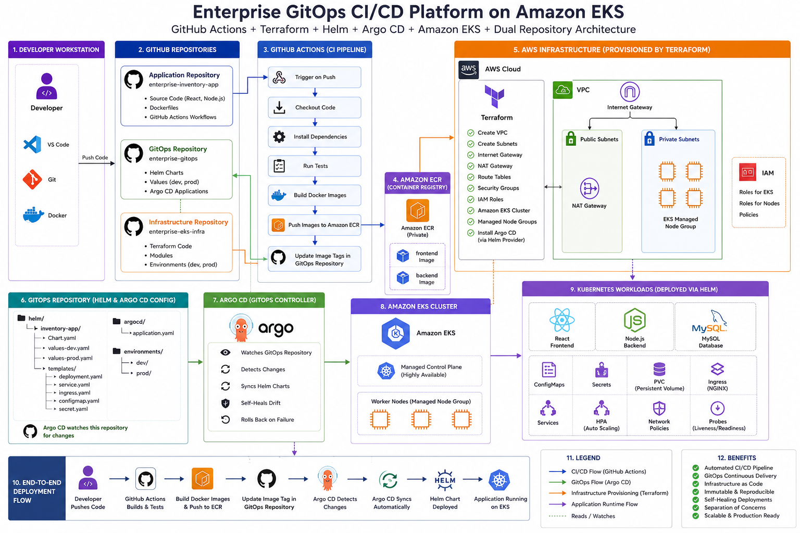
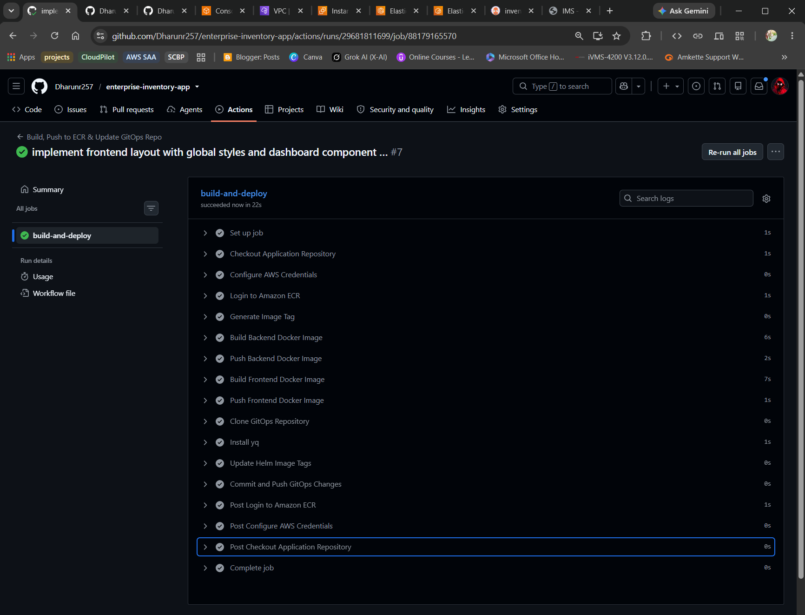
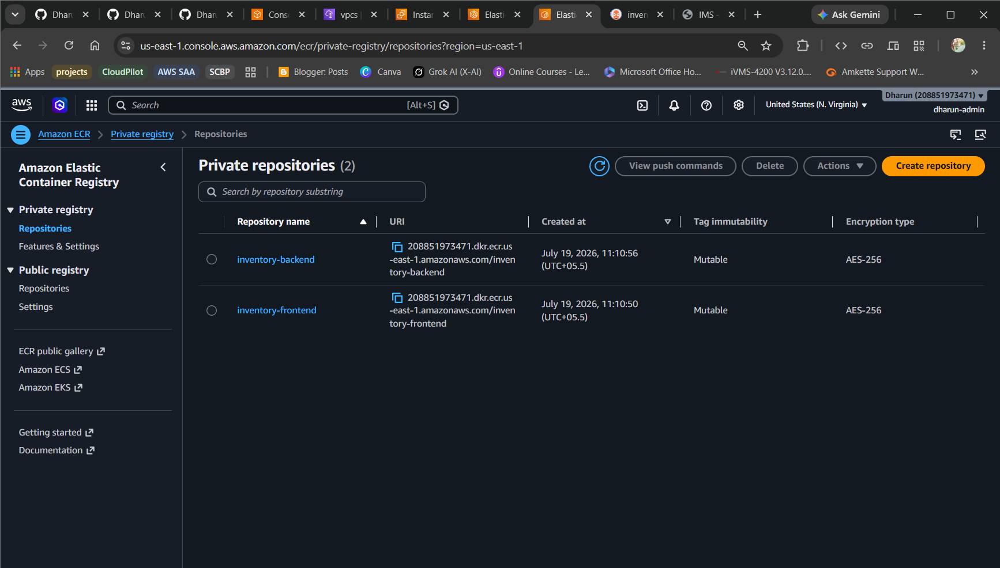
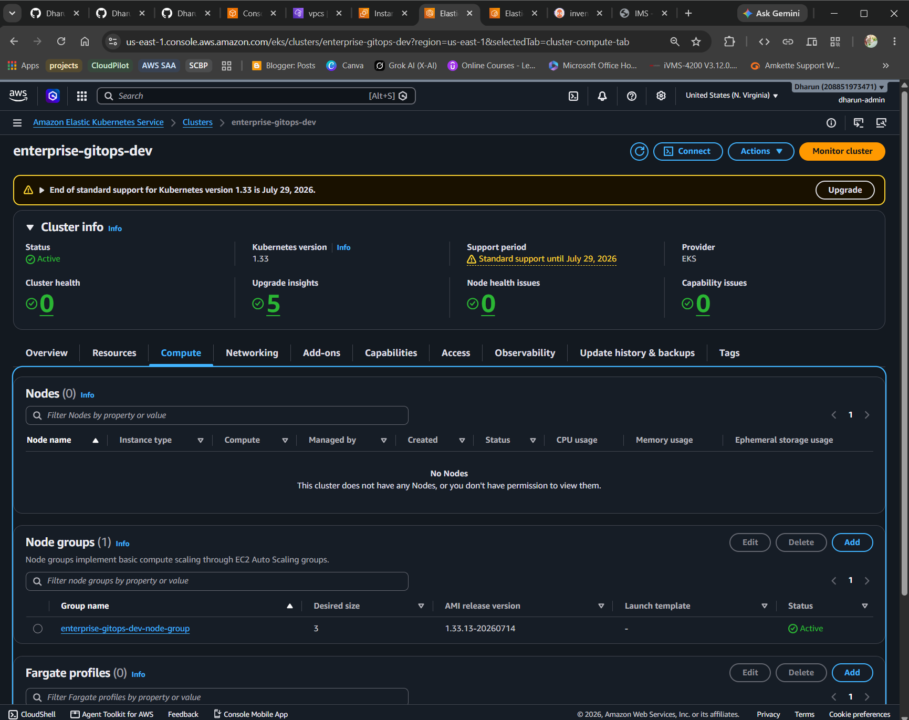
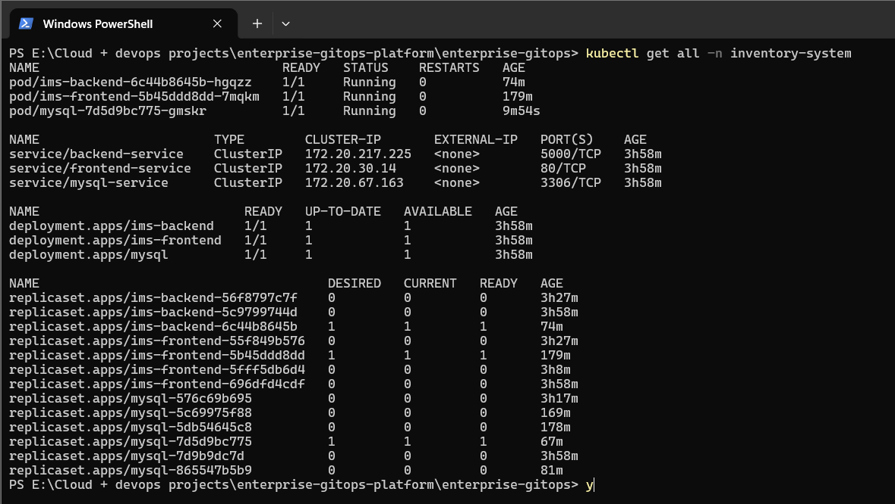
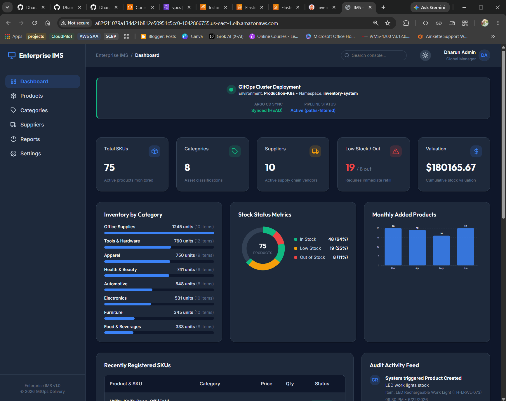
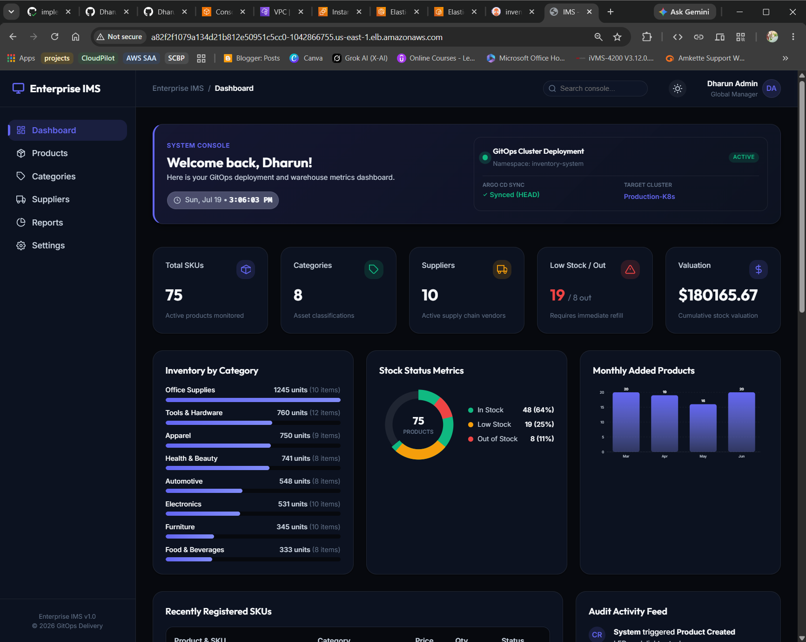

<div align="center">

# ☸️ Enterprise GitOps CI/CD Platform on Amazon EKS

### GitHub Actions + Terraform + Helm + Argo CD + Amazon EKS — Three-Repository GitOps Architecture

[](https://argo-cd.readthedocs.io/)
[](https://github.com/features/actions)
[](https://www.terraform.io/)
[](https://kubernetes.io/)
[](https://aws.amazon.com/eks/)
[](https://helm.sh/)
[](LICENSE)

**A production-inspired enterprise delivery platform split across three purpose-built repositories — application, infrastructure, and GitOps — where every deployment to Amazon EKS is driven end-to-end by Git commits, GitHub Actions, and Argo CD, with zero manual `kubectl apply`.**

**📍 This repository (`enterprise-gitops`) is the GitOps control layer — the one Argo CD watches and continuously reconciles against.**

</div>

---

## 🏆 What This Project Demonstrates

This isn't a single-repo demo chart — it's a real three-repository enterprise delivery platform, engineered to mirror how platform teams actually separate concerns between app code, infrastructure, and deployment config.

| Skill Area | What I Built |
|---|---|
| ☸️ GitOps Delivery | Argo CD `Application` with automated sync, self-healing, and pruning against Amazon EKS |
| 🏗️ Multi-Repository Architecture | Application, infrastructure, and GitOps concerns split into three independently-versioned repos |
| ⚙️ CI Automation | GitHub Actions building Docker images, pushing to Amazon ECR, and updating this repo's image tags |
| 🌍 Infrastructure as Code | Terraform-provisioned VPC, NAT Gateway, EKS cluster, managed node groups, and IAM (via `enterprise-eks-infra`) |
| 📦 Helm Packaging | A first-class Helm chart templating frontend, backend, MySQL, ingress, and persistent storage |
| 🔁 Continuous Reconciliation | Self-healing sync policy that reverts manual cluster drift back to the state defined in Git |
| 💾 Stateful Workloads on K8s | MySQL deployed with a PersistentVolumeClaim backed by Amazon EBS |
| 🔐 Safe Rollouts | Foreground pruning, prune-last ordering, and exponential-backoff retries to avoid destructive sync races |

---

## 🏗️ Full Platform Architecture

<p align="center">
  
</p>

> The diagram above is the complete platform: a developer pushes code → GitHub Actions builds and pushes images to Amazon ECR and updates this GitOps repository → Argo CD detects the change and syncs Helm-templated manifests → Amazon EKS (provisioned separately by Terraform) reconciles to the new desired state. This repository is the GitOps config Argo CD watches, and the controller logic that acts on it.

### Design Principles

- **Git is the single source of truth.** No engineer runs `kubectl apply` against the cluster directly — Argo CD owns reconciliation end to end.
- **Three repos, three lifecycles.** Application code, infrastructure, and deployment config each change at a different cadence and are reviewed by different concerns, so each lives in its own repository rather than one monorepo.
- **Self-healing by default.** Any out-of-band change to the live cluster is treated as drift and automatically reverted back to what's declared in Git.
- **Infrastructure and delivery are decoupled.** Terraform provisions the EKS cluster and networking once; this repo redeploys the application many times a day without ever touching infrastructure state.

---

## 🔄 End-to-End Deployment Flow

```
Developer
   │  git push
   ▼
enterprise-inventory-app  (Application Repository)
   ├── React frontend, Node.js backend, Dockerfiles
   ▼
GitHub Actions (CI Pipeline)
   ├── Checkout code
   ├── Install dependencies & run tests
   ├── Build Docker images (frontend, backend)
   ├── Tag image with commit SHA
   ├── Push images → Amazon ECR
   └── Update image tag in enterprise-gitops (this repo)
   ▼
enterprise-gitops  (GitOps Repository)
   ├── argocd/inventory-app.yaml   → Argo CD Application definition
   ├── base/                       → Kustomize-native manifests
   └── inventory-app-helm/         → Helm chart (Argo CD sync target)
   ▼
Argo CD (GitOps Controller, running on EKS)
   ├── Watches this repository
   ├── Detects the new image tag
   ├── Renders the Helm chart
   ├── Compares desired vs live state
   ├── Syncs automatically (prune + selfHeal)
   └── Rolls back on failed health checks
   ▼
Amazon EKS  (provisioned by enterprise-eks-infra / Terraform)
   ├── VPC, public & private subnets, NAT Gateway
   ├── Managed Node Groups
   └── IAM Roles for EKS & nodes
   ▼
Kubernetes Workloads (namespace: inventory-system)
   ├── React Frontend        ├── ConfigMaps / Secrets
   ├── Node.js Backend       ├── PersistentVolumeClaim (MySQL)
   ├── MySQL Database        └── Ingress (NGINX)
```

---

## 🛠️ Tech Stack

| Category | Tools |
|---|---|
| GitOps Engine | Argo CD (automated sync, self-heal, rollback) |
| CI (upstream repo) | GitHub Actions |
| Infrastructure as Code (upstream repo) | Terraform — VPC, NAT Gateway, EKS, Managed Node Groups, IAM |
| Container Orchestration | Amazon EKS |
| Container Registry | Amazon ECR (private) |
| Packaging | Helm 3 |
| Declarative Manifests | Kustomize |
| Networking | Kubernetes Ingress (NGINX class), ClusterIP Services |
| Storage | Amazon EBS CSI Driver, PersistentVolumeClaim |
| Application Runtime | React (frontend), Node.js/Express (backend), MySQL 8.0 |

---

## 🔗 Three-Repository Architecture

This platform is intentionally split across three repositories, each with a single responsibility:

```
Enterprise GitOps CI/CD Platform
│
├── enterprise-inventory-app        (Application Repository)
│   ├── React frontend + Node.js backend source
│   ├── Dockerfiles
│   └── GitHub Actions CI workflow
│
├── enterprise-eks-infra            (Infrastructure Repository)
│   ├── Terraform modules
│   ├── VPC, subnets, NAT Gateway, Internet Gateway
│   ├── Amazon EKS cluster & Managed Node Groups
│   └── IAM roles & policies
│
└── enterprise-gitops               (GitOps Repository — this repo)
    ├── argocd/                     Argo CD Application definitions
    ├── base/                       Kustomize manifests
    └── inventory-app-helm/         Helm chart (Argo CD sync target)
```

| Repository | Description | Link |
|---|---|---|
| **enterprise-inventory-app** | React + Node.js/MySQL application source and the GitHub Actions CI pipeline that builds and pushes images | [github.com/Dharunr257/enterprise-inventory-app](https://github.com/Dharunr257/enterprise-inventory-app.git) |
| **enterprise-eks-infra** | Terraform infrastructure that provisions the VPC, NAT Gateway, Amazon EKS cluster, and IAM this platform runs on | [github.com/Dharunr257/enterprise-eks-infra](https://github.com/Dharunr257/enterprise-eks-infra.git) |
| **enterprise-gitops** *(this repo)* | The GitOps delivery layer — Argo CD Application, Helm chart, and Kustomize base that Argo CD continuously reconciles | [github.com/Dharunr257/enterprise-gitops](https://github.com/Dharunr257/enterprise-gitops.git) |

---

## 📁 Repository Structure (this repo)

```
enterprise-gitops/
│
├── argocd/
│   └── inventory-app.yaml         # Argo CD Application definition
│
├── base/                          # Kustomize-native manifests
│   ├── namespace.yaml
│   ├── frontend-deployment.yaml
│   ├── frontend-service.yaml
│   ├── backend-deployment.yaml
│   ├── backend-configmap.yaml
│   ├── backend-service.yaml
│   ├── mysql-deployment.yaml
│   ├── mysql-service.yaml
│   ├── mysql-pvc.yaml
│   ├── mysql-secret.yaml
│   ├── ingress.yaml
│   └── kustomization.yaml
│
├── inventory-app-helm/             # Helm chart (Argo CD sync target)
│   ├── Chart.yaml
│   ├── values.yaml
│   └── templates/
│       ├── namespace.yaml
│       ├── frontend-deployment.yaml
│       ├── frontend-service.yaml
│       ├── backend-deployment.yaml
│       ├── backend-configmap.yaml
│       ├── backend-service.yaml
│       ├── mysql-deployment.yaml
│       ├── mysql-service.yaml
│       ├── mysql-pvc.yaml
│       ├── mysql-secret.yaml
│       ├── ingress.yaml
│       ├── _helpers.tpl
│       └── NOTES.txt
│
├── screenshots/
│
└── README.md
```

---

## 📖 Implementation Walkthrough

### Step 1 — CI Builds & Pushes Images to Amazon ECR

Every push to `enterprise-inventory-app` triggers a GitHub Actions workflow that builds the frontend and backend Docker images, tags them with the commit SHA, and pushes them to a private Amazon ECR repository.

<p align="center">
  
</p>

<p align="center">
  
</p>

The final CI step updates the image tag in this repository's `inventory-app-helm/values.yaml` and commits the change — which is the trigger for everything downstream.

---

### Step 2 — Terraform Provisions Amazon EKS

`enterprise-eks-infra` provisions the VPC (public/private subnets, NAT Gateway, Internet Gateway), the EKS control plane, managed node groups, and IAM roles the platform runs on.

<p align="center">
  
</p>

---

### Step 3 — Define the Argo CD Application

The `Application` custom resource in `argocd/inventory-app.yaml` is what turns this Git repository into a live, continuously reconciled deployment.

```yaml
apiVersion: argoproj.io/v1alpha1
kind: Application
metadata:
  name: inventory-app
  namespace: argocd
  finalizers:
    - resources-finalizer.argocd.argoproj.io
spec:
  project: default
  source:
    repoURL: https://github.com/Dharunr257/enterprise-gitops.git
    targetRevision: main
    path: inventory-app-helm
    helm:
      releaseName: inventory-app
  destination:
    server: https://kubernetes.default.svc
    namespace: inventory-system
  syncPolicy:
    automated:
      prune: true
      selfHeal: true
      allowEmpty: false
    syncOptions:
      - CreateNamespace=true
      - PrunePropagationPolicy=foreground
      - PruneLast=true
      - RespectIgnoreDifferences=true
    retry:
      limit: 5
      backoff:
        duration: 5s
        factor: 2
        maxDuration: 3m
  revisionHistoryLimit: 10
```

<p align="center">
  
</p>

---

### Step 4 — Package the Application as a Helm Chart

`inventory-app-helm/Chart.yaml` defines the release Argo CD templates and applies on every sync:

```yaml
apiVersion: v2
name: inventory-app
description: Enterprise Inventory Management System Helm Chart
type: application
version: 1.0.0
appVersion: "1.0.0"
maintainers:
  - name: Dharun R
```

Key configuration surfaced through `values.yaml`:

```yaml
global:
  imageRegistry: <AWS_ACCOUNT_ID>.dkr.ecr.us-east-1.amazonaws.com
namespace: inventory-system

frontend:
  replicaCount: 1
  service:
    type: ClusterIP
    port: 80

backend:
  replicaCount: 1
  service:
    type: ClusterIP
    port: 5000

mysql:
  image:
    repository: mysql
    tag: "8.0"
  persistence:
    enabled: true
    storageClass: gp2
    accessMode: ReadWriteOnce
    size: 10Gi
  auth:
    database: inventory_db
    username: inventory_user
    # password / rootPassword sourced from a Kubernetes Secret,
    # never committed in plaintext to this repository

ingress:
  enabled: true
  className: nginx
```

CPU/memory `requests` and `limits` are set per component (frontend, backend, MySQL) so the scheduler has accurate bin-packing information and no single pod can starve the node.

---

### Step 5 — Argo CD Syncs & Reconciles the Cluster

Once the `Application` is applied to the `argocd` namespace, Argo CD watches this repository, renders the Helm chart, and reconciles the `inventory-system` namespace automatically — no manual `kubectl apply` at any point.

<p align="center">
  
</p>

<p align="center">
  
</p>

---

### Step 6 — Ship an Update Through the Same GitOps Loop

A code change in `enterprise-inventory-app` triggers CI → new image tag → Argo CD detects the change → automated sync → rollout on EKS, with zero manual cluster access.

<p align="center">
  
</p>

<p align="center">
  
</p>

---

## 🧠 Engineering Decisions

> Every sync flag and repo boundary here was chosen deliberately after seeing what goes wrong without it — not left as defaults.

| Decision | Why |
|---|---|
| Three separate repositories instead of one monorepo | Application code, infrastructure, and deployment config change at different rates and need different review gates — coupling them would force every app change through infra review and vice versa |
| `selfHeal: true` | Manual `kubectl` changes against the cluster are treated as drift and automatically reverted — Git stays the only path to change state |
| `prune: true` + `PruneLast=true` | Resources removed from Git are deleted from the cluster, but only *after* new/updated resources are healthy — avoids a window with zero healthy replicas |
| `PrunePropagationPolicy=foreground` | Deletions wait for dependent resources to finish terminating, preventing orphaned Pods or dangling PVC mounts |
| `CreateNamespace=true` | The `inventory-system` namespace is itself part of desired state, not a manual pre-step an operator can forget |
| Separate Helm chart *and* Kustomize base | Decouples the templating mechanism from the desired-state definition — the same manifests can be reconciled as a versioned Helm release or as raw Kustomize output |
| Retry with exponential backoff (5 attempts, 5s → 3m) | Transient EKS API throttling or CRD propagation delays fail a sync attempt without failing the whole rollout |
| Image tag driven by Helm `values.yaml`, updated by CI | Keeps the only mutable, frequently-changing field (the image tag) isolated from the rest of the chart, minimizing diff noise on every deploy |
| MySQL credentials via Kubernetes Secret, not inline values | Even in a GitOps repo, secrets are never committed in plaintext — only Secret *references* live in version control |

---

## 🎓 Skills Demonstrated

**GitOps & Continuous Delivery**

`Argo CD` `Automated Sync` `Self-Healing Deployments` `Drift Detection` `Declarative Delivery`

**CI/CD & Infrastructure**

`GitHub Actions` `Amazon ECR` `Terraform` `Amazon EKS` `Managed Node Groups` `IAM`

**Kubernetes Packaging**

`Helm Charts` `Kustomize` `ConfigMaps` `Secrets` `PersistentVolumeClaims` `Ingress`

**Engineering Practice**

`Multi-Repository Architecture` `Environment-Agnostic Manifests` `Safe Rollout Ordering`

---

## 🚀 Future Roadmap

- [ ] Argo CD ApplicationSets for multi-environment (dev/stage/prod) rollout from one repo
- [ ] Progressive delivery with Argo Rollouts (canary / blue-green)
- [ ] External Secrets Operator + AWS Secrets Manager instead of static Kubernetes Secrets
- [ ] Prometheus + Grafana for cluster and application observability
- [ ] Horizontal Pod Autoscaler and Cluster Autoscaler
- [ ] Policy enforcement with Kyverno
- [ ] Multi-cluster GitOps with Argo CD ApplicationSets across regions

---

## 📝 Notes

This repository intentionally targets AWS Free Tier–compatible resources (a single-node MySQL PVC on `gp2`, minimal replica counts) while preserving production-shaped GitOps patterns: automated sync, self-healing, ordered pruning, and clean separation across the application, infrastructure, and delivery repositories.

---

<div align="center">

*Built as the GitOps control layer of a three-repository enterprise delivery platform — declarative Argo CD sync, self-healing infrastructure, and safe automated rollouts onto Amazon EKS, inspired by real-world production platform engineering.*

</div>

# 👨‍💻 Author

### Dharun R

**Project:** Enterprise GitOps CI/CD Platform on Amazon EKS

---
